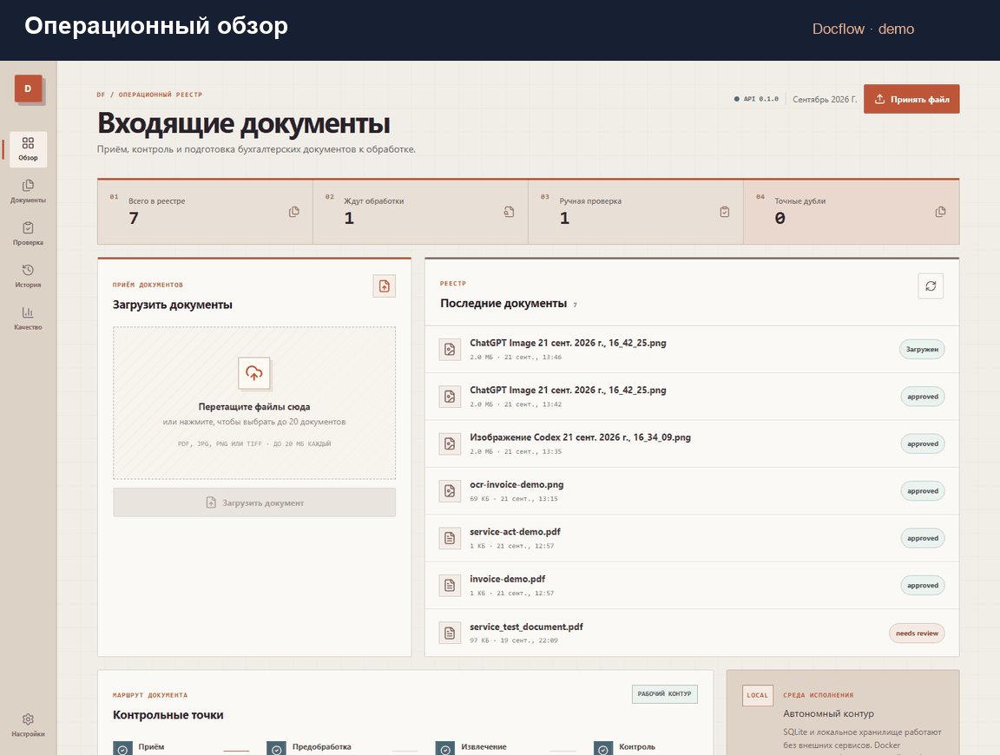
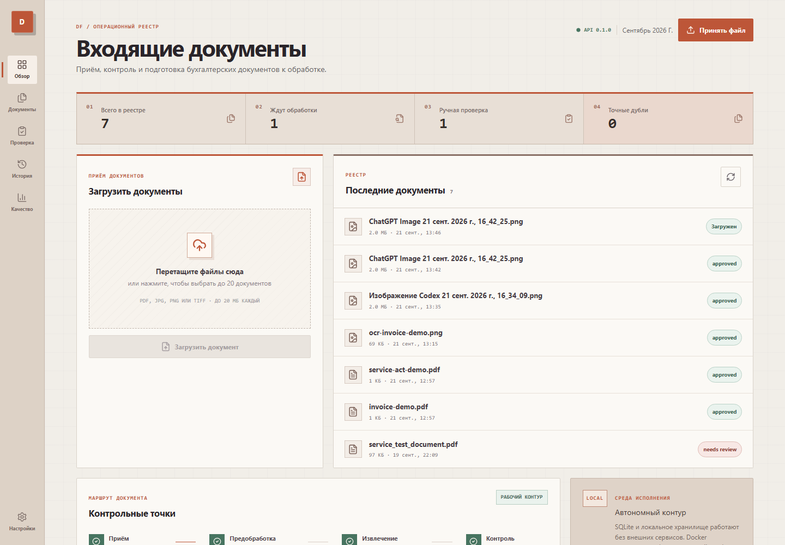
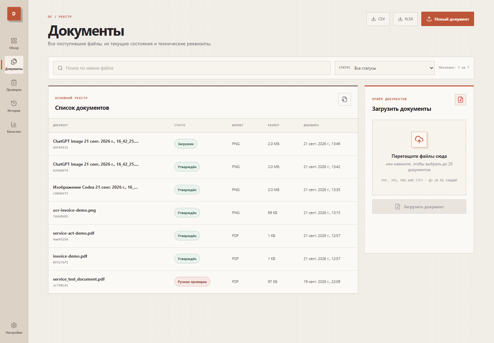
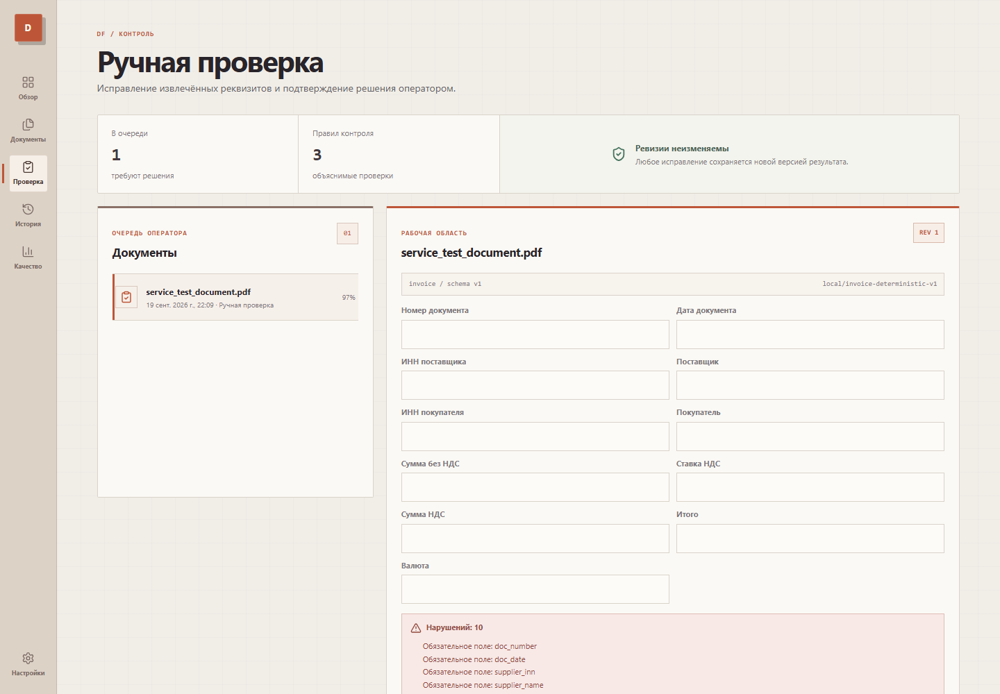
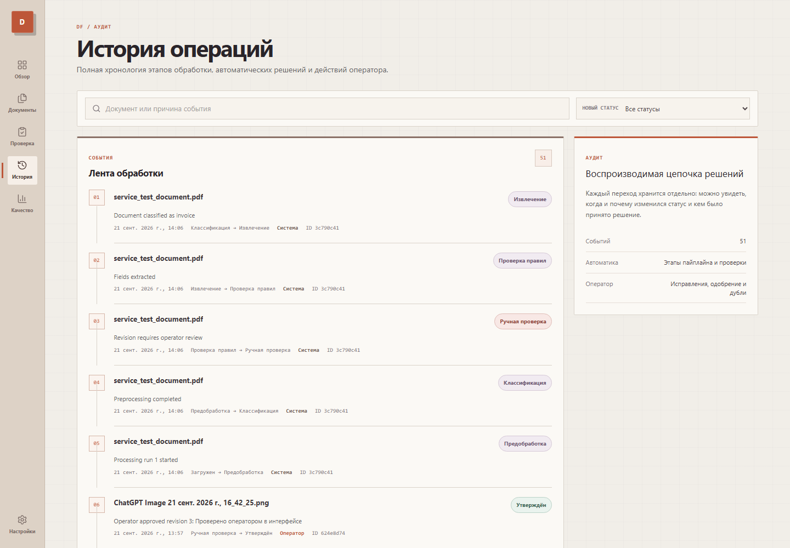
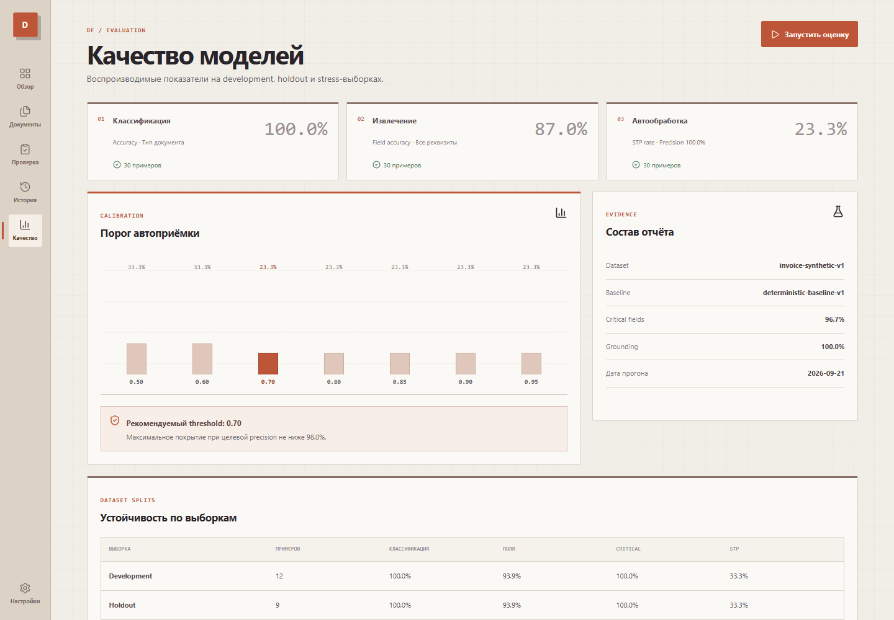
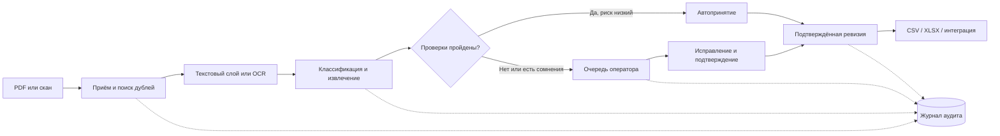
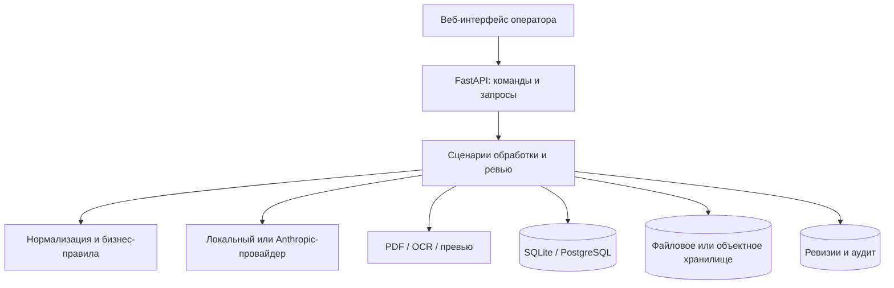

# Docflow

**Docflow превращает входящие счета и акты в проверенные структурированные данные.** Система
сама читает PDF и сканы, извлекает реквизиты, находит ошибки и дубликаты, а бухгалтер подключается
только там, где действительно нужно решение человека.

[Посмотреть GIF-демо](docs/assets/demo.gif) · [Сценарий на 5 минут](docs/demo.md) ·
[Запустить локально](#быстрый-запуск)



## Бизнес-задача

Бухгалтерия получает документы из почты, мессенджеров, ЭДО и отсканированных архивов. Реквизиты
приходится переносить вручную, перепроверять суммы и НДС, искать повторные документы и выяснять,
кто принял спорное решение. При росте потока это создаёт очередь, ошибки и непрозрачность.

Docflow закрывает этот путь в одном рабочем окне:

| Было | Стало с Docflow |
| --- | --- |
| Ручной перенос каждого реквизита | Автоматическое распознавание и нормализация полей |
| Одинаковая проверка всех документов | Оператор видит только исключения и рискованные случаи |
| Ошибки в ИНН, НДС, итогах и датах | Детерминированные проверки до принятия документа |
| Дубли обнаруживаются постфактум | Точные и бизнес-дубликаты выявляются при обработке |
| Непонятно, кто и почему изменил результат | Неизменяемые ревизии и полная история решений |
| Ручная подготовка данных к выгрузке | Экспорт подтверждённых данных в CSV и XLSX |

Результат — меньше рутинного ввода, единый контроль качества и прозрачный процесс, который можно
показать аудитору или руководителю. При этом система не делает вид, что ИИ всегда прав:
**ИИ предлагает, правила проверяют, человек принимает спорное решение**.

## Что видит пользователь

| Операционный обзор | Реестр документов |
| --- | --- |
|  |  |
| **Ручная проверка** — очередь исключений, редактирование и подтверждение | **История** — кто, когда и почему изменил статус |
|  |  |

### Измеримое качество, а не «магия ИИ»

Отдельный экран показывает точность классификации и извлечения, grounding, долю автообработки и
калибровку порога. Метрики считаются на раздельных development, holdout и OCR-stress выборках.



## Как проходит документ



## Архитектура



Модель не может самостоятельно принять документ. Финальное состояние определяется прикладным
слоем по результатам проверок, подтверждению источником и порогу уверенности. Повторная обработка
и ручное исправление создают новую ревизию, не уничтожая исходный результат.

## Возможности завершённого релиза

- пакетная загрузка до 20 PDF, JPEG, PNG или TIFF по 20 МБ;
- извлечение текста из цифровых PDF и OCR сканов через Tesseract (`rus+eng`);
- счета и акты выполненных работ с версионируемыми схемами;
- проверка обязательных полей, ИНН, дат, НДС, итогов и grounding;
- автообработка безопасных результатов и очередь ручной проверки;
- точные и бизнес-дубликаты;
- неизменяемые ревизии и журнал всех переходов;
- evaluation на независимых наборах и калибровка порога;
- экспорт подтверждённых данных в UTF-8 CSV и XLSX;
- локальный воспроизводимый режим без платных внешних сервисов;
- опциональное подключение Anthropic через тот же контракт провайдера.

<details>
<summary><strong>Технологический стек</strong></summary>

| Слой | Технологии |
| --- | --- |
| API | Python 3.11–3.13, FastAPI, Pydantic, SQLAlchemy, Alembic |
| Обработка | PyMuPDF, Pillow, OpenCV, pytesseract, RapidFuzz |
| ИИ | воспроизводимый локальный провайдер; опционально Anthropic |
| Интерфейс | React 19, TypeScript, Vite, React Router, TanStack Query |
| Локальное хранение | SQLite и файловая система |
| Production-профиль | PostgreSQL, Redis, Celery, MinIO, Docker Compose |
| Качество | pytest, Ruff, mypy, ESLint, TypeScript |

</details>

---

## Для технической команды

## Быстрый запуск

### Требования

- Windows и PowerShell;
- Python 3.11, 3.12 или 3.13;
- Node.js и npm;
- Tesseract OCR с русским и английским языковыми пакетами — только для сканов и изображений;
- Docker Desktop — только для запуска Compose-профиля.

### 1. Установка зависимостей

Из корня репозитория выполните:

```powershell
.\scripts\bootstrap.ps1
```

Скрипт создаст `apps/api/.venv`, установит API с dev-зависимостями и выполнит `npm install` для
веб-интерфейса.

При необходимости скопируйте `.env.example` в `.env` и измените параметры:

```powershell
Copy-Item .env.example .env
```

Значения по умолчанию уже подходят для локального демо и не требуют внешних сервисов.

### 2. Запуск API

```powershell
cd apps/api
.\.venv\Scripts\Activate.ps1
uvicorn docflow.main:app --reload
```

API будет доступен по адресу `http://localhost:8000`, Swagger UI —
`http://localhost:8000/docs`.

### 3. Запуск интерфейса

В отдельном окне PowerShell:

```powershell
cd apps/web
npm run dev
```

Откройте `http://localhost:5173`.

Локальный профиль хранит метаданные в `apps/api/storage/docflow.db`, а исходные и производные
файлы — в `apps/api/storage/`. Эти данные исключены из Git.

## OCR

Для цифровых PDF дополнительное системное ПО не требуется. Для сканов установите Tesseract OCR
с языками `rus` и `eng`.

В Windows стандартная установка
`C:\Program Files\Tesseract-OCR\tesseract.exe` обнаруживается автоматически. Нестандартный путь
можно указать в `.env`:

```dotenv
DOCFLOW_TESSERACT_CMD=C:/Tools/Tesseract-OCR/tesseract.exe
DOCFLOW_OCR_LANGUAGES=rus+eng
```

Проверка OCR независимо от приложения:

```powershell
$env:PYTHONPATH="apps/api/src"
apps/api/.venv/Scripts/python.exe scripts/verify_ocr.py
```

Если OCR недоступен, документ не теряется: обработка получает состояние `awaiting_ocr` и может
быть возобновлена после установки Tesseract.

## Демо за пять минут

Сгенерируйте воспроизводимые тестовые документы:

```powershell
apps/api/.venv/Scripts/python.exe scripts/generate_demo_documents.py
```

Файлы появятся в `fixtures/demo-documents/`. После запуска API и интерфейса:

1. Загрузите `invoice-demo.pdf` и `service-act-demo.pdf` одной пачкой.
2. На странице **«Документы»** запустите обработку обоих файлов.
3. На странице **«Проверка»** измените поле и создайте операторскую ревизию, затем подтвердите её.
4. Выгрузите подтверждённые данные в CSV или XLSX.
5. На странице **«История»** проверьте системные и операторские переходы.
6. На странице **«Качество»** запустите оценку и изучите метрики и рекомендуемый порог.

Отдельный сценарий демонстрации описан в [docs/demo.md](docs/demo.md).

## Провайдеры извлечения

### Локальный режим

По умолчанию используется `DOCFLOW_LLM_PROVIDER=mock`. Несмотря на историческое имя настройки,
это локальный детерминированный провайдер: он анализирует распознанный текст текущего документа и
не отправляет данные во внешние сервисы. Такой режим бесплатен, работает офлайн и даёт
воспроизводимый результат.

### Anthropic

Для проверки реальной модели задайте в `.env`:

```dotenv
DOCFLOW_LLM_PROVIDER=anthropic
DOCFLOW_ANTHROPIC_API_KEY=your-api-key
DOCFLOW_ANTHROPIC_MODEL=your-model-id
```

Ключи нельзя добавлять в Git. Файл `.env` уже находится в `.gitignore`.

## Оценка качества

Воспроизводимый baseline запускается командой:

```powershell
apps/api/.venv/Scripts/python.exe scripts/evaluate.py
```

Отчёт включает точность классификации, точность всех и критичных полей, grounding, покрытие и
точность straight-through processing, а также кривую выбора порога. Результаты записываются в
`datasets/generated/` и доступны в разделе **«Качество»** через API.

## Проверка проекта

Полный набор автоматических проверок:

```powershell
.\scripts\verify.ps1
```

Он последовательно запускает:

- тесты API (`pytest`);
- статический анализ и проверку форматирования Python (`ruff`);
- строгую типизацию Python (`mypy`);
- линтер веб-приложения (`eslint`);
- production-сборку TypeScript/Vite.

## Основные API-маршруты

Все маршруты имеют префикс `/api/v1`.

| Метод и путь | Назначение |
| --- | --- |
| `GET /health` | состояние API |
| `GET /ready` | готовность API и базы данных |
| `GET /capabilities` | активный провайдер, OCR, лимиты и типы документов |
| `POST /documents` | загрузка документа |
| `GET /documents` | список документов |
| `POST /documents/{id}/process` | запуск обработки |
| `POST /documents/{id}/duplicate-decision` | решение по точному дубликату |
| `GET /documents/{id}/runs` | история запусков обработки |
| `GET /documents/{id}/revisions` | ревизии результата |
| `POST /documents/{id}/revisions/{revision_id}/corrections` | операторское исправление |
| `POST /documents/{id}/revisions/{revision_id}/approve` | подтверждение ревизии |
| `GET /audit/events` | журнал переходов статусов |
| `GET /quality/report` | последний отчёт качества |
| `POST /quality/run` | запуск оценки качества |
| `GET /exports/revisions?format=csv\|xlsx` | экспорт подтверждённых ревизий |

Актуальные схемы запросов и ответов всегда доступны в Swagger UI.

## Структура репозитория

```text
apps/
  api/                    FastAPI, домен, сценарии, инфраструктура и тесты
  web/                    React-интерфейс оператора
schemas/                  версионируемые схемы типов документов
prompts/                  версионируемые шаблоны извлечения
fixtures/
  llm/                    профили локального провайдера
  demo-documents/         демонстрационные PDF и изображения
datasets/generated/       генерируемые датасеты и отчёты качества
docs/                     архитектура, roadmap и сценарий демонстрации
scripts/                  установка, проверка, OCR, генерация и evaluation
compose.yaml              инфраструктурный Docker Compose-профиль
```

Подробнее об устройстве системы: [docs/architecture.md](docs/architecture.md). Завершённые этапы
и границы релиза: [docs/roadmap.md](docs/roadmap.md). Идеи за пределами релиза:
[BACKLOG.md](BACKLOG.md).

## Docker Compose

В репозитории есть профиль с PostgreSQL, Redis, MinIO, API, Celery worker и веб-интерфейсом:

```powershell
docker compose up --build
```

Он показывает направление production-развёртывания. Основной портфолио-сценарий намеренно
остаётся самодостаточным и использует SQLite, локальные файлы и синхронную обработку.

## Архитектурные свойства

- **Модульный монолит:** домен, прикладные сценарии и инфраструктура разделены явно.
- **Human in the loop:** рискованные или неполные результаты не принимаются автоматически.
- **Неизменяемость:** повторная обработка и исправления добавляют ревизии вместо перезаписи.
- **Аудит:** каждый переход хранит автора, причину, старый и новый статус и время.
- **Расширяемость:** новый тип документа можно добавить схемой и промптом, если достаточно
  существующих нормализаторов, валидаторов и UI-компонентов.
- **Воспроизводимость:** локальный провайдер и независимый evaluation не требуют сетевых вызовов.

## Ограничения и дальнейшее развитие

Текущий релиз предназначен для локальной демонстрации и портфолио. Для промышленной эксплуатации
потребуются аутентификация и роли, многопользовательская изоляция, фоновые очереди, объектное
хранилище, мониторинг, резервное копирование, CI/CD и защищённое развёртывание. Эти задачи явно
вынесены в backlog и не маскируются демо-зависимостями.
